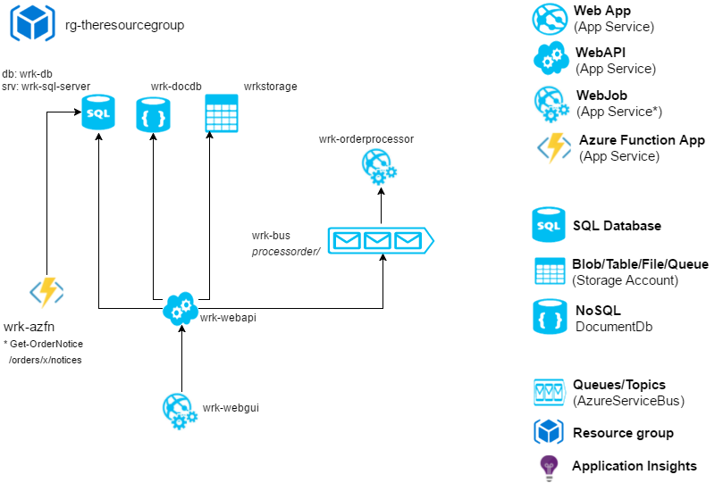

# AZURE WORKSHOP

Build a WebAPI and consume different datasources: AzureSQL, DocDb and StorageAccount.Tables

# TOOLS AND RESOURCES

* SQL Server Management Studio (download the free community/develop edition, dunno if it works connecting to Azure tho)
* Azure DocumentDb Studio (google it)
* Microsoft Azure Storage Explorer (google it)
* Service Bus Explorer (not using in this workshop yet)
* https://www.guidgenerator.com/online-guid-generator.aspx  (generate guids for stuff we persist in the database)

# STEP BY STEP

## Create a WebApi (or use the prepared one in here)
* In Azure: (API App or Web App doesn't matter)
* Download PublishProfile
* Create VS Projet: ASP.NET Application, dont use any template, check the MVC tickbox (NOT Azure!)
* For the demo, use the created project Orders.WebApi 
	* In OrderController, choose the MockRepo
* Debug and make sure the /Orders route works
* Click Publish on the Webapi, Import the downloaded publish profile
* When published, make sure it works in azure, route /Orders

## Create SQL Database and use it from the WebApi
* In Azure: Create SQL Server
	* Click the Firewall and add the IP you're on
	* Note serverurl
* In Azure: Create SQL Database
	* Remember login and pass: hejsan | !FooBar123
	* Note databasename
* Create VS Project: Class Lib (no special nuget pkg needed)
* In SQLSMSS : Connect 'SERVERNAME.database.windows.net,1433' user:'hejsan' pass: '!FooBar123' 
	* From: Server-Security-Login, create a login by running:
		CREATE LOGIN hej
			WITH PASSWORD = '!FooBar123' 
		GO
	* From: Server-Database-Security-Usern, create a user, using that login by running:
		CREATE USER hejsan
			FOR LOGIN hejsan
			WITH DEFAULT_SCHEMA = dbo
		GO
		EXEC sp_addrolemember N'db_owner', N'hejsan'
		GO
	* Create Table by running
	
	USE [name-of-database-replaceme!!!!]

	CREATE TABLE [dbo].[Orders](
		[Identifier] [uniqueidentifier] NOT NULL,
		[Name] [varchar](50) NOT NULL,
		[TimeStamp] [datetime] NOT NULL
	) 
	GO
* Add some rows, generate guid from some online guid generator
* Use Orders.constructor
	* Update AzSqlRepository.Constructor with newly created server, database, login and password
	* Go to OrderController, choose the AzSqlRepository in the constructor
	* Run and HTTP GET /orders/
	* Deploy to Azure and see if it works (Right click the Web API, Publish, go to /Orders route)
		
## Create Storage Account, and use the Table flavour from the WebApi
* Create Storage Account (general purpose, local redundant) and note the name: blablastorage
* VS Project Orders.AzStorageRepository 
	* The dependent Nuget package is: WindowsAzure.Storage
	* Update and consolidate dependencies (and also Newtonsoft to be sure)
* Use tool: Storage Explorer and create table Orders, with one row (the first row defines the table schema)
	* RowKey: 7751c3b5-856c-4cc1-81ba-ff9dede45bbb
	* PartitionKey: nya
	* Identifier: 7751c3b5-856c-4cc1-81ba-ff9dede45bbb
	* TimeStamp: 2017-05-03T18:40:45.2650652+02:00
	* Name: Foofofoo
	* Value: {"Identifier":"c799fef2-160c-461e-9e0c-c6ff72ea79a2","Name":"Fooaoaoa","TimeStamp":"2017-05-03T18:40:45.2650652+02:00"}
* Copy the connectionstring from the Storage Account :DefaultEndpointsProtocol=https;AccountName=blablastorage;AccountKey=SOMEKEY;EndpointSuffix=core.windows.net
* Update AzTableStorageRepo.Constructor with the storage account info
* Run and HTTP GET /orders/
* Deploy to Azure and see if it works (Right click the Web API, Publish, go to /Orders route)
	
## Create NoSQL (DocumentDb) and use it from the WebApi
* Azure: Create a NoSQL
	* Instance: someNoSqlName
	* Database: Dump
	* Collection: Orders
* VS Project Orders.AzStorageRepository 
	* The dependent Nuget package is: Microsoft.Azure.DocumentDB
	* Consolidate nugets
* Use Tool: DocDb Explorer, connect to HTTPS Endpoint and use the READWRITE key (found in the created nosql in Azure)
* Update AzDocDbRepository.Constructor with info to the newly created docdb
* Go to OrderController, choose the AzDocdbRepository in the constructor

* Make a post to /Orders to create an entity
* Use Tool: DocDb to make sure it's there
* Run and HTTP GET /orders/
* Deploy to Azure and see if it works (Right click the Web API, Publish, go to /Orders route)

## Create a Webjob
* Since those can be contained with any app service, right click the webjob and publish (import) and choose the publish profile for the WebApi we downloaded earlier
* However, these webjobs need their own storage account to dump logs in to, So in the constructor Programs.cs, send the StorageAcctConnString to the JobHost
* We can see logs of running webjobs by using the 'WebJob DashboardW', from the AzurePortal click WebJobs, click "Logs", but for this to work the containing App Service
	must have a ConnectionString "AzureWebJobsDashboard" configured, therefore use the same StorageAcctConnString as above.

## Create an Azure Function (incomplete)

Still to do.. the SDK is broken right now (thanks Microsoft!)

# TODO

* Make all Repositories accept logins, passwords and uris in the constructor
* Implement all Add() methods in all repositories, we only got DocDb for now
* AzureStorage Repository: Add blob and file repositories
* Finish the Azure Function workshop
* Create the Webjob + WebGui + ServiceBus workshop
	* Make a WebGui that sends stuff to a queue using AzureBusSDK
	* Make the Webjob triggered by that queue using AzureBusSDK
	* Make the WebGui use MassTransit to send commands
	* Make the Webjob have a MassTransit command consumer
	* Do the same with MassTransit queries
	* Do the same with MassTransit-Autonatonomous Sagas (Workflows, Transactions)